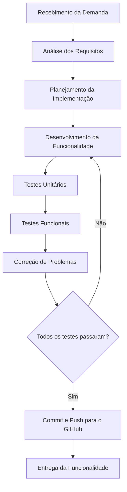

# PBL 8 – Qualidade de Processo

**Disciplina:** Qualidade de Software

**Projeto:** LocalEats

**Aluno:** Caio Assmann

---

# Objetivo

Esta atividade tem como objetivo analisar o processo de desenvolvimento utilizado pela equipe durante a construção do sistema **LocalEats**, identificando as etapas do fluxo de trabalho, suas entradas e saídas, bem como refletindo sobre a influência da qualidade do processo na qualidade do software produzido.

---

# 1. Mapeamento do Processo Atual

O processo utilizado pela equipe durante o desenvolvimento do LocalEats segue uma sequência de atividades desde o recebimento da demanda até a entrega da funcionalidade.

## Fluxograma

## Descrição do Processo

O processo inicia com o recebimento de uma nova demanda ou requisito para o sistema. Após compreender a necessidade, a equipe realiza o planejamento da implementação e inicia o desenvolvimento da funcionalidade.

Durante o desenvolvimento são executados testes unitários e testes funcionais automatizados para verificar se a funcionalidade atende aos requisitos esperados.

Caso sejam encontrados defeitos, o código retorna para a etapa de desenvolvimento até que todos os testes sejam aprovados. Após essa validação, a funcionalidade é enviada para o repositório GitHub e considerada pronta para entrega.

---

# 2. Entradas, Atividades e Saídas

| Etapa                  | Entrada                       | Atividade                                              | Saída                                   |
| ---------------------- | ----------------------------- | ------------------------------------------------------ | --------------------------------------- |
| Recebimento da demanda | Solicitação da funcionalidade | Compreender o problema e os requisitos                 | Requisitos definidos                    |
| Planejamento           | Requisitos definidos          | Planejamento da solução e divisão das tarefas          | Plano de implementação                  |
| Desenvolvimento        | Plano de implementação        | Codificação da funcionalidade                          | Código desenvolvido                     |
| Testes Unitários       | Código implementado           | Execução de testes automatizados das regras de negócio | Funcionalidade validada individualmente |
| Testes Funcionais      | Funcionalidade implementada   | Validação dos fluxos completos da aplicação            | Fluxo validado                          |
| Correções              | Relatórios de falhas          | Correção dos defeitos encontrados                      | Código corrigido                        |
| Controle de Versão     | Código aprovado               | Commit e Push para o GitHub                            | Histórico atualizado                    |
| Entrega                | Código validado               | Disponibilização da funcionalidade                     | Funcionalidade entregue                 |

---

# 3. Reflexão sobre o Processo

## O processo utilizado pela equipe está claramente definido?

Sim. Ao longo do desenvolvimento do projeto foi estabelecido um fluxo de trabalho que contempla análise dos requisitos, implementação, testes, correções e entrega. Isso proporcionou maior organização durante o desenvolvimento das funcionalidades.

---

## Todos os integrantes seguem o mesmo fluxo de trabalho?

O objetivo é que todos utilizem o mesmo processo para manter a padronização do projeto. Entretanto, pequenas diferenças podem ocorrer durante a implementação individual de cada funcionalidade, sendo importante documentar e seguir um processo comum para toda a equipe.

---

## Em quais etapas a qualidade é verificada?

A qualidade é verificada principalmente nas seguintes etapas:

* Revisão dos requisitos.
* Desenvolvimento da funcionalidade.
* Testes unitários.
* Testes funcionais automatizados.
* Correção dos defeitos encontrados antes da entrega.

---

## Quais melhorias poderiam tornar o processo mais eficiente?

Algumas melhorias que poderiam aumentar a eficiência do processo são:

* Padronização das revisões de código (Code Review).
* Integração contínua (CI) para execução automática dos testes.
* Utilização de Pull Requests obrigatórios.
* Definição de critérios de aceite para todas as funcionalidades.
* Aumento da cobertura dos testes automatizados.

---

## Como a qualidade do processo impacta a qualidade do produto final?

Um processo bem definido reduz retrabalho, melhora a comunicação entre os integrantes da equipe e facilita a identificação precoce de defeitos.

Além disso, o uso contínuo de testes automatizados durante o desenvolvimento aumenta a confiabilidade das funcionalidades implementadas e reduz a possibilidade de regressões, contribuindo diretamente para um software mais estável e de melhor qualidade.

---

# Conclusão

A análise do processo de desenvolvimento do LocalEats demonstra que a qualidade não depende apenas da implementação correta do código, mas também da organização das atividades realizadas pela equipe.

A definição de um processo estruturado, aliado à utilização de testes automatizados, controle de versão e validações contínuas, contribui significativamente para a entrega de um software mais confiável, organizado e de fácil manutenção.

Compreender o processo de desenvolvimento permite identificar oportunidades de melhoria contínua, reduzindo falhas e aumentando a qualidade do produto final.
